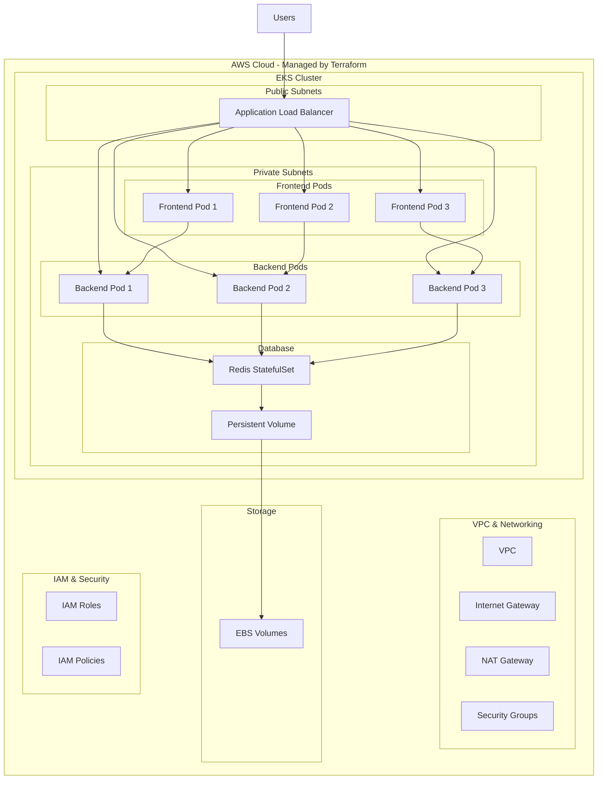

# 🗳️ Voting App - Kubernetes Microservices with Terraform

**Advanced Voting App built with Kubernetes on AWS EKS and infrastructure managed via Terraform**

[🚀 Demo](#demo) • [📋 Requirements](#requirements) • [⚡ Quick Installation](#quick-installation) • [🏗️ Infrastructure](#infrastructure)

---

## 📖 Overview

A modern microservices-based voting application deployed on **Kubernetes**, allowing users to vote between cats and dogs. This project uses **Terraform** to manage the entire infrastructure on **AWS EKS**, with an **Application Load Balancer (ALB)** ensuring high availability and performance.

### ✨ Key Features

- 🏗️ Microservices Architecture
- ☸️ Kubernetes Native with StatefulSets for persistent storage
- 🔧 Infrastructure as Code using Terraform (no external modules)
- 🔄 Load Balancing via AWS ALB Ingress
- 💾 Persistent Storage using AWS EBS
- 🔒 Encrypted data in transit and at rest
- 📊 Health Monitoring with readiness/liveness checks
- 🎨 Responsive Frontend (Arabic UI included)
- ⚡ Live Result Updates
- 🔧 Horizontal & Vertical Scalability

---

## 🏗️ Application Architecture

## 🛠️ Tech Stack

### Infrastructure
- Terraform – Infrastructure provisioning (no modules)
- AWS Provider

### Backend
- Python 3.9
- Flask
- Redis

### Frontend
- Flask (Python)
- HTML/CSS/JavaScript

### Platform
- Kubernetes
- AWS EKS
- AWS ALB
- AWS EBS
- AWS VPC
- Docker

---

## 📋 Requirements

### Local Environment
- Terraform >= 1.0
- kubectl >= 1.24
- Docker >= 20.10
- AWS CLI >= 2.0
- Git

### AWS Resources
- AWS Account
- Configured AWS CLI
- Optional: S3 + DynamoDB for Terraform state
