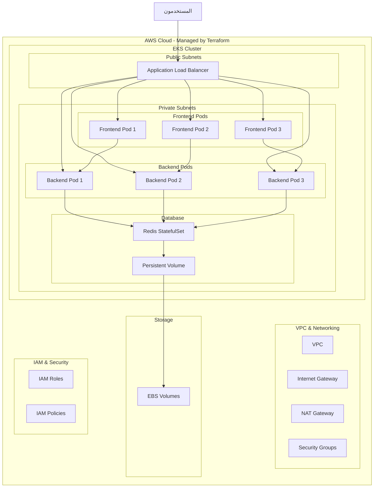

# 🗳️ Voting App - Kubernetes Microservices with Terraform

<div align="center">


**تطبيق تصويت متقدم مبني على Kubernetes مع AWS EKS وإدارة البنية التحتية بـ Terraform**

[🚀 Demo](#demo) • [📋 المتطلبات](#المتطلبات) • [⚡ التثبيت السريع](#التثبيت-السريع) • [🏗️ البنية التحتية](#البنية-التحتية)

</div>

---

## 📖 نظرة عامة

تطبيق تصويت حديث مبني بتقنية **Microservices** على **Kubernetes** يتيح للمستخدمين التصويت بين الكلاب والقطط. يستخدم التطبيق **Terraform** لإدارة البنية التحتية بالكامل على **AWS EKS** مع **Application Load Balancer (ALB)** لضمان الأداء العالي والتوفر المستمر.

### ✨ المميزات الرئيسية

- 🏗️ **بنية Microservices** منفصلة ومرنة
- ☸️ **Kubernetes Native** مع StatefulSets للبيانات
- 🔧 **Infrastructure as Code** مع Terraform (بدون modules)
- 🔄 **Load Balancing** مع AWS ALB Ingress
- 💾 **Persistent Storage** مع AWS EBS
- 🔒 **تشفير البيانات** في التخزين والنقل
- 📊 **مراقبة الصحة** مع Health Checks
- 🎨 **واجهة مستخدم عربية** جذابة ومتجاوبة
- ⚡ **تحديث فوري** للنتائج
- 🔧 **قابلية التوسع** الأفقية والعمودية

---

## 🏗️ معمارية التطبيق



---

## 🛠️ التقنيات المستخدمة

### Infrastructure as Code
- **Terraform** - إدارة البنية التحتية (بدون modules)
- **AWS Provider** - موفر الخدمات السحابية

### Backend
- **Python 3.9** - لغة البرمجة الأساسية
- **Flask** - إطار عمل الويب
- **Redis** - قاعدة بيانات في الذاكرة للتخزين السريع

### Frontend
- **Python Flask** - خادم الواجهة الأمامية
- **HTML5/CSS3** - تصميم الواجهة
- **JavaScript** - التفاعل والتحديث التلقائي

### Infrastructure
- **Kubernetes** - تنسيق الحاويات
- **AWS EKS** - خدمة Kubernetes المدارة
- **AWS ALB** - موزع الأحمال التطبيقي
- **AWS EBS** - التخزين المستمر
- **AWS VPC** - الشبكة الافتراضية
- **Docker** - حاويات التطبيقات

---

## 📋 المتطلبات

### البيئة المحلية
- **Terraform** >= 1.0
- **kubectl** >= 1.24
- **Docker** >= 20.10
- **AWS CLI** >= 2.0
- **Git** للاستنساخ

### AWS Resources (يتم إنشاؤها بـ Terraform)
- **AWS Account** مع صلاحيات مناسبة
- **AWS CLI** مكون مع credentials
- **Terraform State Backend** (S3 + DynamoDB - اختياري)

---

## 🏗️ البنية التحتية

### مكونات Terraform المطلوبة

البنية التحتية تتضمن الموارد التالية (بدون استخدام modules):

```hcl
# الموارد الأساسية المطلوبة:
- aws_vpc
- aws_internet_gateway
- aws_nat_gateway
- aws_subnet (public & private)
- aws_route_table
- aws_security_group
- aws_eks_cluster
- aws_eks_node_group
- aws_iam_role
- aws_iam_policy
- aws_iam_role_policy_attachment
- aws_ebs_csi_driver
- aws_lb_controller (ALB Ingress Controller)
```

### متغيرات Terraform المقترحة

```hcl
# variables.tf
variable "cluster_name" {
  description = "EKS cluster name"
  type        = string
  default     = "voting-app-cluster"
}

variable "region" {
  description = "AWS region"
  type        = string
  default     = "us-east-1"
}

variable "node_instance_type" {
  description = "EC2 instance type for EKS nodes"
  type        = string
  default     = "t3.medium"
}

variable "desired_capacity" {
  description = "Desired number of nodes"
  type        = number
  default     = 3
}
```

---

## ⚡ التثبيت السريع

### 1. استنساخ المشروع
```bash
git clone https://github.com/your-username/voting-app-kubernetes.git
cd voting-app-kubernetes
```

### 2. إعداد البنية التحتية بـ Terraform
```bash
# تهيئة Terraform
terraform init

# مراجعة الخطة
terraform plan

# تطبيق البنية التحتية
terraform apply -auto-approve

# الحصول على kubeconfig
aws eks update-kubeconfig --region us-east-1 --name voting-app-cluster
```

### 3. تثبيت ALB Ingress Controller
```bash
# تثبيت ALB Ingress Controller (إذا لم يكن مثبت بـ Terraform)
kubectl apply -k "github.com/aws/eks-charts/stable/aws-load-balancer-controller//crds?ref=master"

# أو استخدام Helm
helm repo add eks https://aws.github.io/eks-charts
helm install aws-load-balancer-controller eks/aws-load-balancer-controller \
  -n kube-system \
  --set clusterName=voting-app-cluster \
  --set serviceAccount.create=false \
  --set serviceAccount.name=aws-load-balancer-controller
```

### 4. نشر التطبيق
```bash
# تطبيق جميع الموارد
kubectl apply -f kubernetes/

# أو تطبيق كل ملف منفصل
kubectl apply -f kubernetes/redis-deployment.yaml
kubectl apply -f kubernetes/backend-deployment.yaml
kubectl apply -f kubernetes/frontend-deployment.yaml
kubectl apply -f kubernetes/ingress.yaml
```

### 5. التحقق من التثبيت
```bash
# مراقبة حالة الـ Pods
kubectl get pods -w

# التحقق من الخدمات
kubectl get services

# مراقبة الـ Ingress والحصول على ALB URL
kubectl get ingress voting-ingress
```

---

## 🔧 إدارة البنية التحتية

### أوامر Terraform الأساسية

```bash
# عرض الموارد الحالية
terraform show

# عرض حالة الموارد
terraform state list

# تحديث مورد معين
terraform apply -target=aws_eks_cluster.main

# تدمير البنية التحتية
terraform destroy

# تنسيق الملفات
terraform fmt

# التحقق من صحة التكوين
terraform validate
```

### تحديث البنية التحتية

```bash
# تحديث عدد العقد
terraform apply -var="desired_capacity=5"

# تحديث نوع الـ instances
terraform apply -var="node_instance_type=t3.large"

# تطبيق تغييرات محددة
terraform plan -out=tfplan
terraform apply tfplan
```

---

## 🔧 التكوين المتقدم

### تخصيص ALB Ingress
```yaml
# تعديل kubernetes/ingress.yaml
metadata:
  annotations:
    alb.ingress.kubernetes.io/scheme: internet-facing
    alb.ingress.kubernetes.io/target-type: ip
    alb.ingress.kubernetes.io/listen-ports: '[{"HTTP": 80}, {"HTTPS": 443}]'
    alb.ingress.kubernetes.io/ssl-redirect: '443'
    alb.ingress.kubernetes.io/certificate-arn: arn:aws:acm:region:account:certificate/cert-id
```

### تكوين Persistent Storage
```yaml
# تعديل حجم التخزين في kubernetes/redis-deployment.yaml
resources:
  requests:
    storage: 10Gi  # زيادة الحجم حسب الحاجة
```

### تخصيص الموارد
```yaml
# تعديل موارد الـ Pods
resources:
  requests:
    memory: "256Mi"
    cpu: "250m"
  limits:
    memory: "512Mi"
    cpu: "500m"
```

---

## 📊 المراقبة والصيانة

### مراقبة الصحة
```bash
# فحص صحة الـ Pods
kubectl get pods -o wide

# عرض لوجز التطبيق
kubectl logs -f deployment/frontend-deployment
kubectl logs -f deployment/backend-deployment
kubectl logs -f deployment/redis-deployment

# فحص الأحداث
kubectl get events --sort-by=.metadata.creationTimestamp

# مراقبة استهلاك الموارد
kubectl top nodes
kubectl top pods
```

### مراقبة ALB
```bash
# فحص حالة ALB
aws elbv2 describe-load-balancers --region us-east-1

# فحص Target Groups
aws elbv2 describe-target-groups --region us-east-1

# مراقبة Health Checks
aws elbv2 describe-target-health --target-group-arn <target-group-arn>
```

### النسخ الاحتياطي
```bash
# نسخ احتياطي لبيانات Redis
kubectl exec -it redis-deployment-xxx -- redis-cli BGSAVE

# تصدير التكوينات
kubectl get all -o yaml > backup-$(date +%Y%m%d).yaml

# نسخ احتياطي لـ Terraform state
terraform state pull > terraform-state-backup-$(date +%Y%m%d).json
```

### التوسع
```bash
# زيادة عدد النسخ
kubectl scale deployment frontend-deployment --replicas=5
kubectl scale deployment backend-deployment --replicas=5

# التوسع التلقائي
kubectl autoscale deployment frontend-deployment --cpu-percent=70 --min=3 --max=10

# تحديث عدد العقد بـ Terraform
terraform apply -var="desired_capacity=5"
```

---

## 🐛 استكشاف الأخطاء

### مشاكل شائعة وحلولها

#### 1. مشاكل Terraform
```bash
# تحديث providers
terraform init -upgrade

# إعادة تهيئة state
terraform init -reconfigure

# استيراد موارد موجودة
terraform import aws_eks_cluster.main voting-app-cluster
```

#### 2. Pods في حالة Pending
```bash
# فحص الأحداث
kubectl describe pod <pod-name>

# التحقق من الموارد المتاحة
kubectl top nodes

# فحص Node Groups
aws eks describe-nodegroup --cluster-name voting-app-cluster --nodegroup-name <nodegroup-name>
```

#### 3. مشاكل الشبكة
```bash
# اختبار الاتصال بين الخدمات
kubectl exec -it <frontend-pod> -- curl http://backend-service:8088/api/health

# فحص Security Groups
aws ec2 describe-security-groups --group-ids <sg-id>
```

#### 4. مشاكل التخزين
```bash
# فحص PVC
kubectl get pvc
kubectl describe pvc redis-pvc

# فحص StorageClass
kubectl get storageclass

# فحص EBS volumes
aws ec2 describe-volumes --region us-east-1
```

#### 5. مشاكل ALB
```bash
# فحص Ingress
kubectl describe ingress voting-ingress

# فحص ALB Controller logs
kubectl logs -n kube-system deployment/aws-load-balancer-controller

# فحص ALB في AWS Console
aws elbv2 describe-load-balancers --names voting-app-alb
```

---

## 🔒 الأمان

### أفضل الممارسات المطبقة

- ✅ **تشفير البيانات** في التخزين والنقل
- ✅ **IAM Roles** مع أقل الصلاحيات المطلوبة
- ✅ **Security Groups** مقيدة للمنافذ المطلوبة فقط
- ✅ **Private Subnets** للـ worker nodes
- ✅ **Network Policies** لعزل الشبكة
- ✅ **Resource Limits** لمنع استنزاف الموارد
- ✅ **Health Checks** للمراقبة المستمرة
- ✅ **Non-root Containers** لتقليل المخاطر

### تحسينات أمنية إضافية
```bash
# إنشاء Network Policy
kubectl apply -f - <<EOF
apiVersion: networking.k8s.io/v1
kind: NetworkPolicy
metadata:
  name: voting-app-netpol
spec:
  podSelector:
    matchLabels:
      app: frontend
  policyTypes:
  - Ingress
  - Egress
EOF
```

### إعدادات IAM المطلوبة
```json
{
  "Version": "2012-10-17",
  "Statement": [
    {
      "Effect": "Allow",
      "Action": [
        "eks:*",
        "ec2:*",
        "iam:*",
        "elasticloadbalancing:*"
      ],
      "Resource": "*"
    }
  ]
}
```

---

## 📈 الأداء والتحسين

### مؤشرات الأداء
- **Response Time**: < 200ms للصفحة الرئيسية
- **Throughput**: 1000+ طلب/ثانية
- **Availability**: 99.9% uptime
- **Scalability**: يدعم حتى 10,000 مستخدم متزامن

### تحسينات الأداء
```yaml
# تفعيل Redis persistence optimizations
redis.conf: |
  save 900 1
  save 300 10
  save 60 10000
  maxmemory-policy allkeys-lru
  tcp-keepalive 300
```

### مراقبة الأداء
```bash
# استخدام CloudWatch
aws logs describe-log-groups --region us-east-1

# مراقبة EKS metrics
kubectl get --raw /metrics

# استخدام Prometheus (اختياري)
helm install prometheus prometheus-community/kube-prometheus-stack
```

---

## 💰 إدارة التكاليف

### تحسين التكاليف
```bash
# استخدام Spot Instances
terraform apply -var="node_instance_type=t3.medium" -var="use_spot_instances=true"

# تقليل عدد العقد في أوقات الخمول
terraform apply -var="desired_capacity=1"

# مراقبة التكاليف
aws ce get-cost-and-usage --time-period Start=2024-01-01,End=2024-01-31 --granularity MONTHLY --metrics BlendedCost
```

### تنظيف الموارد
```bash
# حذف التطبيق
kubectl delete -f kubernetes/

# تدمير البنية التحتية
terraform destroy -auto-approve

# تنظيف Docker images
docker system prune -a
```

---

## 🚀 النشر في الإنتاج

### قائمة مراجعة ما قبل النشر

- [ ] **Terraform State Backend** مكون (S3 + DynamoDB)
- [ ] **SSL Certificates** مثبتة على ALB
- [ ] **DNS مخصص** مكون
- [ ] **CloudWatch Monitoring** مفعل
- [ ] **النسخ الاحتياطي التلقائي** مكون
- [ ] **اختبار الأداء** تحت الضغط
- [ ] **مراجعة إعدادات الأمان**
- [ ] **توثيق إجراءات الطوارئ**
- [ ] **CI/CD Pipeline** مكون

### Terraform Backend للإنتاج
```hcl
# backend.tf
terraform {
  backend "s3" {
    bucket         = "voting-app-terraform-state"
    key            = "prod/terraform.tfstate"
    region         = "us-east-1"
    dynamodb_table = "voting-app-terraform-locks"
    encrypt        = true
  }
}
```

### أتمتة النشر
```yaml
# .github/workflows/deploy.yml
name: Deploy to EKS
on:
  push:
    branches: [main]
jobs:
  terraform:
    runs-on: ubuntu-latest
    steps:
      - uses: actions/checkout@v3
      - uses: hashicorp/setup-terraform@v2
      - name: Terraform Apply
        run: |
          terraform init
          terraform apply -auto-approve
        env:
          AWS_ACCESS_KEY_ID: ${{ secrets.AWS_ACCESS_KEY_ID }}
          AWS_SECRET_ACCESS_KEY: ${{ secrets.AWS_SECRET_ACCESS_KEY }}
  
  deploy:
    needs: terraform
    runs-on: ubuntu-latest
    steps:
      - uses: actions/checkout@v3
      - name: Deploy to EKS
        run: |
          aws eks update-kubeconfig --name voting-app-cluster
          kubectl apply -f kubernetes/
```

---

## 📁 هيكل المشروع

```
voting-app-kubernetes/
├── 📁 terraform/                 # ملفات Terraform
│   ├── main.tf                  # الموارد الأساسية
│   ├── variables.tf             # المتغيرات
│   ├── outputs.tf               # المخرجات
│   ├── versions.tf              # إصدارات Providers
│   └── backend.tf               # تكوين Backend
├── 📁 kubernetes/               # ملفات Kubernetes
│   ├── redis-deployment.yaml   # Redis مع Persistent Storage
│   ├── backend-deployment.yaml # Backend API
│   ├── frontend-deployment.yaml# Frontend Web
│   └── ingress.yaml            # ALB Ingress
├── 📁 backend/                  # كود Backend
│   ├── app.py                  # Flask API
│   ├── requirements.txt        # Python dependencies
│   └── Dockerfile             # Docker image
├── 📁 frontend/                 # كود Frontend
│   ├── app.py                  # Flask Web Server
│   ├── requirements.txt        # Python dependencies
│   ├── Dockerfile             # Docker image
│   └── 📁 templates/
│       └── index.html          # الواجهة الأمامية
├── 📁 .github/workflows/        # CI/CD
│   └── deploy.yml              # GitHub Actions
├── README.md                   # هذا الملف
├── .gitignore                  # ملفات مستبعدة
└── LICENSE                     # الترخيص
```

---

## 🤝 المساهمة

نرحب بمساهماتكم! يرجى اتباع الخطوات التالية:

1. **Fork** المشروع
2. إنشاء **feature branch** (`git checkout -b feature/amazing-feature`)
3. **Commit** التغييرات (`git commit -m 'Add amazing feature'`)
4. **Push** إلى البرانش (`git push origin feature/amazing-feature`)
5. فتح **Pull Request**

### إرشادات المساهمة
- اتبع معايير الكود الموجودة
- اختبر Terraform configurations قبل الإرسال
- أضف اختبارات للميزات الجديدة
- حدث الوثائق عند الحاجة
- تأكد من عمل جميع الاختبارات

### تطوير محلي
```bash
# استنساخ المشروع
git clone https://github.com/your-username/voting-app-kubernetes.git

# إنشاء بيئة تطوير
terraform workspace new dev
terraform apply -var="cluster_name=voting-app-dev"

# اختبار التغييرات
kubectl apply -f kubernetes/
```

---

## 📄 الترخيص

هذا المشروع مرخص تحت رخصة MIT - راجع ملف [LICENSE](LICENSE) للتفاصيل.

---

## 👥 الفريق

<table>
  <tr>
    <td align="center">
      <a href="https://github.com/your-username">
        
        <br />
        <sub><b>اسمك</b></sub>
      </a>
      <br />
      <a href="https://github.com/your-username/voting-app-kubernetes/commits?author=your-username" title="Code">💻</a>
      <a href="#design-your-username" title="Design">🎨</a>
      <a href="#infra-your-username" title="Infrastructure">🚇</a>
      <a href="#terraform-your-username" title="Terraform">🏗️</a>
    </td>
  </tr>
</table>

---

## 📞 الدعم والتواصل

- 📧 **Email**: your-email@example.com
- 💬 **Discord**: [رابط الخادم](https://discord.gg/your-server)
- 🐦 **Twitter**: [@your-handle](https://twitter.com/your-handle)
- 📱 **LinkedIn**: [ملفك الشخصي](https://linkedin.com/in/your-profile)

---

## 🔗 روابط مفيدة

- [Terraform AWS Provider Documentation](https://registry.terraform.io/providers/hashicorp/aws/latest/docs)
- [AWS EKS User Guide](https://docs.aws.amazon.com/eks/latest/userguide/)
- [Kubernetes Documentation](https://kubernetes.io/docs/)
- [AWS Load Balancer Controller](https://kubernetes-sigs.github.io/aws-load-balancer-controller/)
- [Redis Configuration](https://redis.io/topics/config)

---

## 🙏 شكر وتقدير

- **HashiCorp** لأداة Terraform الرائعة
- **Kubernetes Community** للوثائق الممتازة
- **AWS** لخدمات EKS المتقدمة
- **Redis Labs** لقاعدة البيانات السريعة
- **Flask Team** لإطار العمل البسيط والقوي

---

<div align="center">

**⭐ إذا أعجبك المشروع، لا تنس إعطاؤه نجمة! ⭐**

Made with ❤️ and ☕ by [اسمك](https://github.com/your-username)

**🚀 Infrastructure as Code | ☸️ Cloud Native | 🔧 DevOps**

</div>